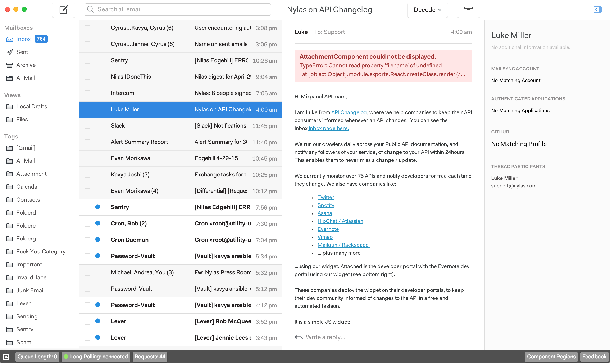

Nylas Mail uses [React](https://facebook.github.io/react/) to create a fast, responsive UI. Packages that want to extend the Nylas Mail interface should use React. Using React's [JSX](https://facebook.github.io/react/docs/jsx-in-depth.html) is optional, but both [JSX](https://facebook.github.io/react/docs/jsx-in-depth.html) and [CJSX](https://github.com/jsdf/coffee-react) (Coffeescript) are available.

For a quick introduction to React, take a look at Facebook's [Getting Started with React](https://facebook.github.io/react/docs/getting-started.html).

#### React Components

Nylas Mail provides a set of core React components you can use in your packages. Many of the standard components listen for key events, include considerations for different platforms, and have extensive CSS. Wrapping standard components makes it easy to build rich interfaces that are consistent with the rest of the Nylas Mail platform.

To use a standard component, require it from `ui-components` and use it in your component's `render` method.

> Keep in mind that React's Component model is based on composition rather than inheritance. On other platforms, you might subclass {Popover} to create your own custom Popover. In React, you should wrap the standard Popover component in your own component, which provides the Popover with `props` and children to customize it's behavior.


Here's a quick look at standard components you can require from `ui-components`:

- **{Menu}**: Allows you to display a list of items consistent with the rest of the Nylas Mail user experience.

- **{Spinner}**: Displays an indeterminate progress indicator centered within it's container.

- **{Popover}**: Component for creating menus and popovers that appear in response to a click and stay open until the user clicks outside them.

- **{Flexbox}**: Component for creating a Flexbox layout.

- **{RetinaImg}**: Replacement for standard `` tags which automatically resolves the best version of the image for the user's display and can apply many image transforms.

- **{ListTabular}**: Component for creating a list of items backed by a paginating ModelView.

- **{MultiselectList}**: Component for creating a list that supports multi-selection. (Internally wraps ListTabular)

- **{MultiselectActionBar}**: Component for creating a contextual toolbar that is activated when the user makes a selection on a ModelView.

- **{ResizableRegion}**: Component that renders it's children inside a resizable region with a draggable handle.

- **{TokenizingTextField}**: Wraps a standard `<input>` and takes function props for tokenizing input values and displaying autocompletion suggestions.

- **{EventedIFrame}**: Replacement for the standard `<iframe>` tag which handles events directed at the iFrame to ensure a consistent user experience.

### React Component Injection

#####Registering Components

Once you've created components, the next step is to register them with the {ComponentRegistry}. The Component Registry enables the React component injection that makes Nylas Mail so extensible. You can request that your components appear in a specific `Location` defined by the {WorkspaceStore}, or register your component for a `Role` that another package has declared.

> The Component Registry allows you to insert your custom component without hacking up the DOM. Register for a `Location` or `Role` and your Component will be rendered into that part of the interface.

It's easy to see where registered components are displayed in Nylas Mail. Enable the Developer bar at the bottom of the app by opening the Inspector panel, and then click "**Component Regions**":


Each region outlined in red is filled dynamically by looking up a React component or set of components from the Component Registry. You can see the role or location you'd need to register for, and the `props` that your component will receive in those locations.

Here are a few examples of how to use it to extend Nylas Mail:

1. Add a component to the Thread List column:

	```coffee
	    ComponentRegistry.register ThreadList,
	      location: WorkspaceStore.Location.ThreadList
	```

2. Add a component to the action bar at the bottom of the Composer:

	```coffee
	    ComponentRegistry.register TemplatePicker,
	      role: 'Composer:ActionButton'
	```

3. Replace the `Participants` component that ships with Nylas Mail to display thread participants on your own:

	```coffee
	    ComponentRegistry.register ParticipantsWithStatusDots,
	        role: 'Participants'
	```

*Tip: Remember to unregister components in the `deactivate` method of your package.*


### Using Registered Components

It's easy to build packages that use the Component Registry to display components vended by other parts of the application. You can query the Component Registry and display the components it returns. The Component Registry is a Reflux-compatible Store, so you can listen to it and update your state as the registry changes.

There are also several convenience components that make it easy to dynamically inject components into your Virtual DOM. These are the preferred way of using injected components.

- {InjectedComponent}: Renders the first component for the `matching` criteria you provide, and passes it the props in `externalProps`. See the API reference for more information.

```coffee
<InjectedComponent
    matching={role:"Attachment"}
    exposedProps={file: file, messageLocalId: @props.localId}/>
```

- {InjectedComponentSet}: Renders all of the components `matching` criteria you provide inside a {Flexbox}, and passes it the props in `externalProps`. See the API reference for more information.

```coffee
<InjectedComponentSet
    className="message-actions"
    matching={role:"MessageAction"}
    exposedProps={thread:@props.thread, message: @props.message}>
```

### Unsafe Components

Nylas Mail considers all injected components "unsafe". When you render them using {InjectedComponent} or {InjectedComponentSet}, they will be wrapped in a component that prevents exceptions in their React render and lifecycle methods from impacting your component. Instead of your component triggering a React Invariant exception in the application, an exception notice will be rendered in place of the unsafe component.



In the future, Nylas Mail may automatically disable packages when their React components throw exceptions.
