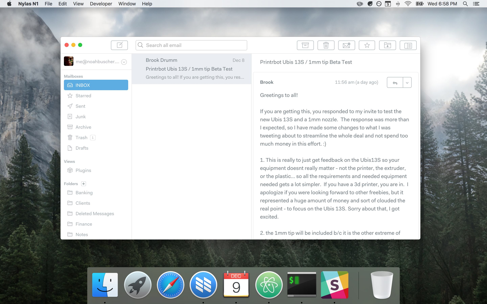

# Taiga

Taiga is a clean, simple, Mailbox-inspired theme for N1 that allows you to focus on what matters most: your emails.

## Installing

1. [Download](https://nylas.com/n1) Nylas N1 email client if you have not yet
2. [Grab](https://github.com/noahbuscher/N1-Taiga/releases) the latest release of Taiga
3. Open `N1>Preferences>General>Select theme` and select `Install new theme...` from the dropdown

Profit! :money_with_wings:
