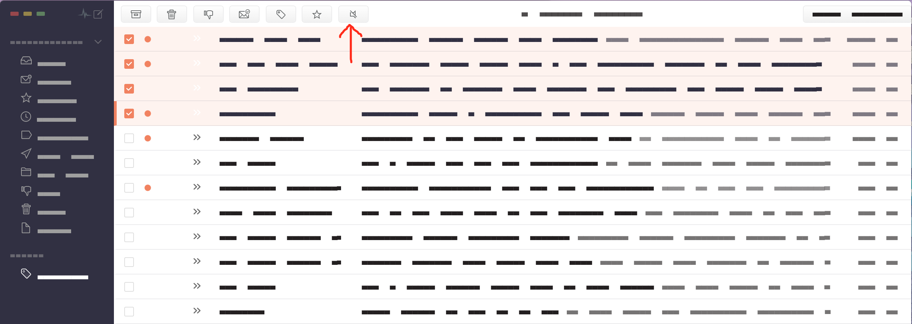
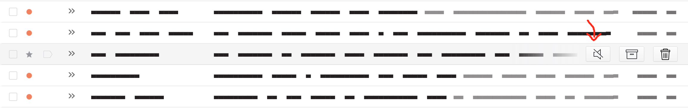
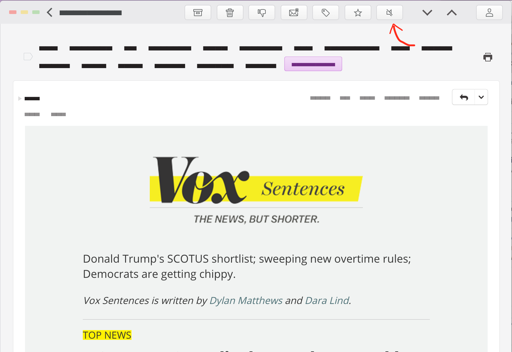

# The Developer and Contributor Guide

## Install this plugin via git

1. Clone this repository into the dev/packages folder (`cd ~/.nylas/dev/packages`): `git clone https://github.com/colinking/n1-unsubscribe.git`

2. Install the package by running the install script: `cd n1-unsubscribe/; make install-dev`

3. Reload Nylas (<kbd>Alt</kbd> + <kbd>Cmd</kbd> + <kbd>L</kbd>) and you should see the plugin in the plugins pane in N1 (`Preferences > Plugins`)

4. To update to the newest version, pull the newest commit and re-run the install script: `git pull && make install-dev`

## Behind the Scenes

We use the list-unsubscribe header that is invisibly attached to most marketing emails. If there is no header, we scour the email body for an unsubscribe link or a phrase describing how to unsubscribe. Once a link is found, either an automated email will be sent or a mini browser will appear that will allow you to quickly unsubscribe without leaving N1. The email is trashed for you once this completes. An important note, if no unsubscribe action is available, the button will be hidden.

#### Bulk Action

(To Be Developed - currently only unsubscribes from the first email selected)

#### Quick Action

From the comfort of your inbox view, you can easily unsubscribe from an email by tapping the new icon alongside the trash and archive buttons that you are used to. If no unsubscribe action is available, the button will be hidden.

#### Menu Item

While reading an email you may realize that you would like to unsubscribe, so instead of scrolling to the bottom of the email and playing the *spot the unsubscribe link game*, which is [an actual game](http://spottheunsubscribe.tumblr.com/), you can press the obvious button at the top.

## Future Features of n1-unsubscribe
- [ ] Bulk-unsubscribe button (can't sequentially unsubscribe)
- [ ] Add Jasmine tests
